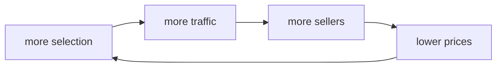

# draft · Phase 01: Competitors and Flywheel

Template: `course/templates/competitors-flywheel.md`. Keep its headings and italic descriptions.

Also read the student's phase 00 draft (`00-opportunity-hypothesis/<same folder>/draft.md`) for the person and the hypothesis; "Where my hypothesis sits" refers to it.

## What each section draws on

| Section | Draw from | Gap if missing |
|---|---|---|
| The Category | Prefilled by /start from team.md. Leave it. | none |
| The market | office-hours Q1: the person, the job, what they choose between, and the link to the hypothesis. | "Which market, exactly: who is choosing, and what are they trying to get done?" |
| Ten competitors | office-hours Q2, the landscape findings, research runs, source pages. One row per competitor; every size signal links to its `sources/` page. Fewer than ten rows is a gap, not padding. Direct/indirect from the student's own classification. | "You have n competitors. Who else would the person choose between? Try /research on <market terms>." |
| The biggest one | office-hours Q3 and the research that checked it: the measure, the number, year, source. | "Biggest by what measure, and where's the number from?" |
| Its flywheel: the drawing | If an image file exists in the folder (`flywheel.png`/`.jpg`), embed it. If not, generate a Mermaid diagram from the student's loop in words (see below) and tell the student how to turn it into the image. | never a gap while the loop in words exists; if neither, gap: "What does the biggest one get more of as it grows?" |
| Its flywheel: the loop in words | office-hours Q4, one line per arrow in the student's wording, with their *because*. | same |
| What slows it down | office-hours Q5. | "What would break this loop?" |
| Where my hypothesis sits | office-hours Q6, tied to the phase 00 draft. | "Does your opportunity ride this loop, fight it, or sit outside it?" |
| AI use | notes.md: skills used, what the AI found or suggested, what the student brought, this drafting step. | never a gap; write it |

## The Mermaid diagram

You may render the student's loop as a diagram, because it is their nodes and their arrows in a different format. You may not add, remove, or rename nodes. Use exactly the nodes from the loop in words, in order, closing the loop:

````

````

Put it under **The drawing**, above the image line, with one sentence: *"GitHub renders this diagram. Once this draft is pushed, open draft.md on github.com, screenshot the diagram, save it as `flywheel.png` in this folder, and /submit will include it."* If a `flywheel.png` already exists, embed it and skip the Mermaid block.

## Voice

The competitor rows should read like the student's notes: *"Everlasting Memorials, the three-location chain my aunt used"* beats *"regional memorialization provider"*. The *because* on each arrow is the student's reasoning, not a textbook's.
